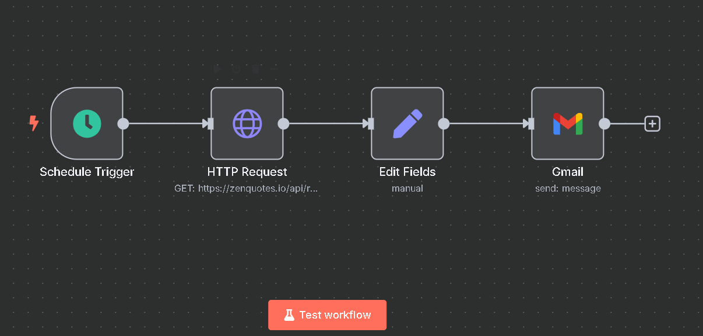

# 🧠 Daily Motivation Emailer with n8n

This project is a simple and fun automation built using **n8n**, a no-code workflow automation tool.  
It sends you a **random motivational quote** to your email every day — perfect for starting your mornings with a boost! 🚀

---

## ✨ What It Does

- ⏰ Uses a **schedule trigger** to run every day
- 🌐 Fetches a quote from a public **API** (`https://zenquotes.io/api/random`)
- 🧹 Formats the quote and author into a clean message
- 📬 Sends the message to your **email inbox**

No code required. Just creativity and curiosity!

---

## 🛠️ Tools Used

- **n8n** – for building the workflow
- **ZenQuotes API** – for fetching motivational quotes
- **Email Node** – to deliver the message

---

## 🚀 How to Use

1. **Install n8n**  
   You can run it locally using Docker or n8n cloud.

2. **Import the Workflow**  
   - Download the `daily-motivation-workflow.json` from this repo
   - Go to your n8n instance → Import Workflow

3. **Configure Email Node**  
   - Add your Gmail (or any SMTP) credentials
   - Customize the "to" email address

4. **Enable the workflow**  
   Boom — daily quotes delivered!

---

## 📸 Workflow Screenshot

![n8n Workflow Screenshot]
<h3 align="center">🧠 Workflow Screenshot</h3>

  

---

## 💡 Why I Built This

I wanted to explore how to work with APIs, handle scheduled tasks, and build real-world automations — all without writing heavy code.

This tiny project helped me:
- Understand **HTTP requests and responses**
- Work with **JSON data**
- Format messages
- Schedule automated tasks
- Use **conditional nodes** and **email actions**

---

## 📬 Want to Try It?

Clone this repo, import the workflow, and give it a go!  
Let me know if you build your own version — I’d love to see it. ✨

---

## 🔗 Credits

- [ZenQuotes.io](https://zenquotes.io) – Free inspirational quote API
- [n8n.io](https://n8n.io) – Open-source automation platform

---

## 🔖 Tags

`#n8n` `#NoCode` `#APIs` `#Automation` `#Productivity` `#LearningByDoing` `#DailyMotivation`
